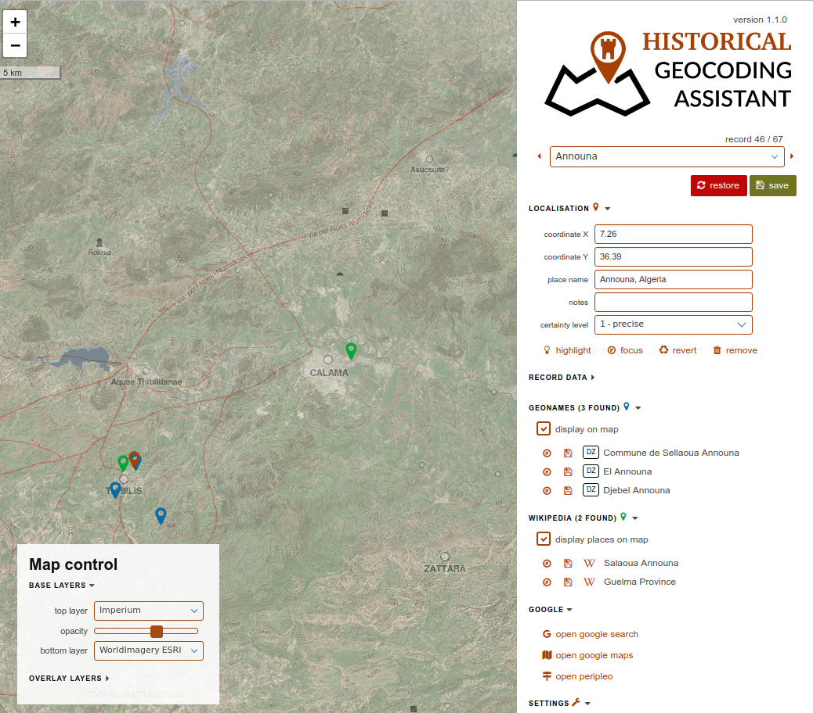

# Historical Geocoding Assistant

## Description

The “Historical Geocoding Assistant” is an open-sourced browser-based application for assigning geographic coordinates in a more convenient and faster way than copy-pasting them from services such as Google Maps. The application was designed with historical projects in mind but is suitable for any geocoding work

## Essential Features

- works online with a live Google Spreadsheets table;
- gathers suggestions of coordinates from gazetteers for instant use (GeoNames, Wikipedia, Getty Thesaurus of Geographic Names, Pleiades, and China Historical GIS);
- integrates search services (Google Maps, Google Search, Peripleo);
- supports multiple base layers (OpenStreetMap, satellite images, Imperium, etc.);
- supports multiple overlay layers;
- allows setting relevant spatial extent;
- allows spatial uncertainty levels.
- ...

## Testing version

Try it [here](http://hde.geogr.muni.cz/hga/)

## Manual

[manual](https://github.com/adammertel/historical-geocoder-assistant/tree/master/manual)

