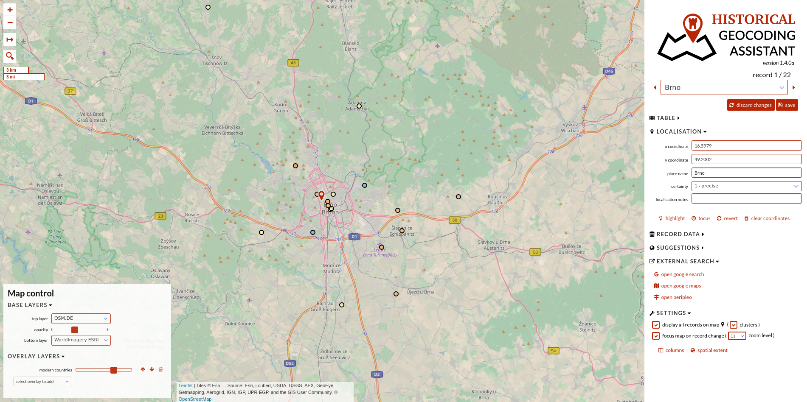

# Historical Geocoding Assistant


## Description

The "Historical Geocoding Assistant" is an open-sourced browser-based application for assigning geographic coordinates in a more convenient and faster way than copy-pasting them from services such as Google Maps. The application was designed with historical projects in mind but is suitable for any geocoding work

## Citation

To cite the software:
`Adam Mertel, David Zbíral, Zdeněk Stachoň, and Hana Hořínková, 'Historical Geocoding Assistant', SoftwareX 14 (2021): 100682, https://doi.org/10.1016/j.softx.2021.100682.`

## Recent Updates

- **Tailwind CSS 4 Integration**: The application now uses Tailwind CSS 4 for styling. A migration from Bulma to Tailwind is in progress. See [TAILWIND-MIGRATION.md](./TAILWIND-MIGRATION.md) for details.
- **Vite Build System**: The build system has been updated to use Vite for faster development and optimized production builds.

## Essential Features

- works online with a live Google Spreadsheets table;
- gathers suggestions of coordinates from gazetteers for instant use (GeoNames, Wikipedia, Getty Thesaurus of Geographic Names, Pleiades, and China Historical GIS);
- integrates search services (Google Maps, Google Search, Peripleo);
- supports multiple base layers (OpenStreetMap, satellite images, Imperium, etc.);
- supports multiple overlay layers;
- allows setting relevant spatial extent;
- allows spatial uncertainty levels.
- …

## Future Development

- integration of additional gazetteers and other relevant services (World-Historical Gazetteer)
- possibility to load a custom map service directly from the GUI
- further improvement of the algorithm to rank and sort geocode suggestions
- management of the custom parametrization of gazetteer calls
- integration of line and polygon topologies
- user management

## Testing version

Try it [here](http://dissinet.cz/apps/hga)

## Manual

[manual](https://github.com/adammertel/historical-geocoder-assistant/tree/master/manual)

## Screenshot



## Development

This project uses Vite as its build tool and Bun as its JavaScript runtime and package manager.

### Setup with Bun (Recommended)

1. Run the setup script to install Bun and dependencies:

   ```
   ./setup-bun.sh
   ```

2. Start development server:

   ```
   bun run dev
   ```

3. Build for production:

   ```
   bun run build
   ```

4. Preview production build:
   ```
   bun run preview
   ```

### Setup with npm (Alternative)

1. Install dependencies:

   ```
   npm install
   ```

2. Start development server:

   ```
   npm run dev
   ```

3. Build for production:

   ```
   npm run build
   ```

4. Preview production build:
   ```
   npm run preview
   ```

## Google API Integration

The application uses Google Sheets API for data management. We've moved from loading Google API scripts via CDN to using npm packages:

- `gapi-script`: For Google API client integration
- `google-auth-library`: For authentication utilities
- `@types/gapi` and `@types/gapi.auth2`: For TypeScript type definitions

This change improves the application's reliability by:

1. Better error handling
2. TypeScript integration
3. Controlled version management
4. Improved authentication flow

### Authentication

The application uses OAuth 2.0 to authenticate with Google's services. Users need to grant permission to access their spreadsheets.
