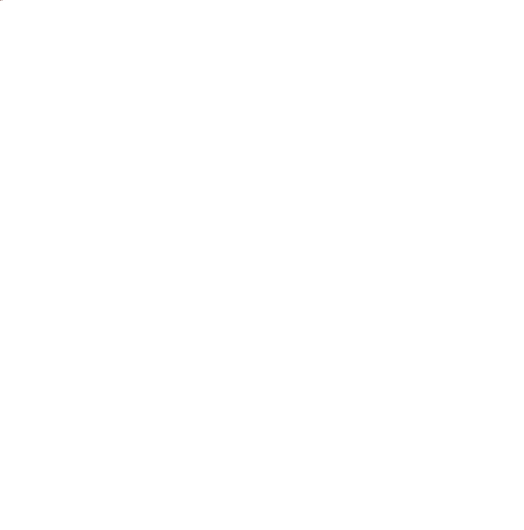
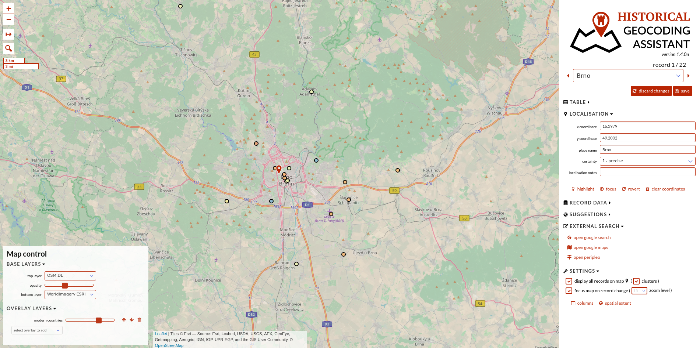
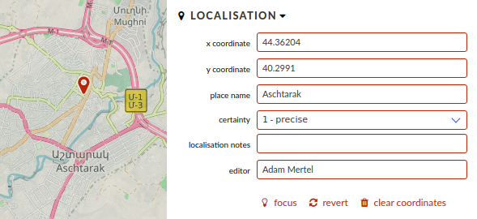
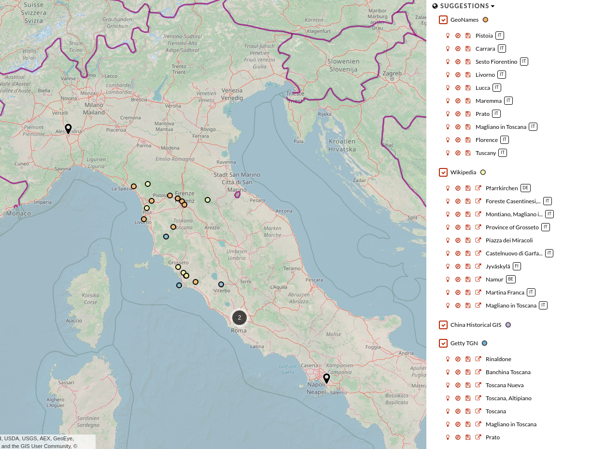
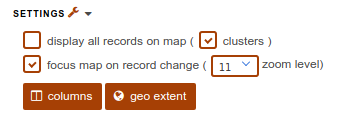
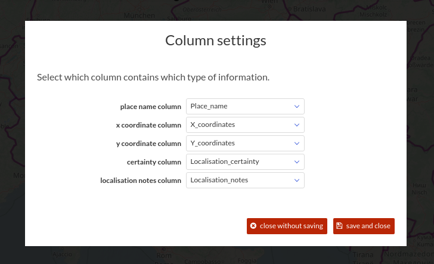
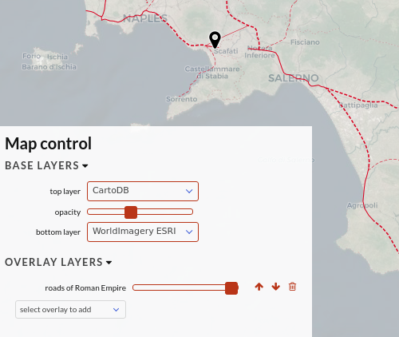

# HISTORICAL GEOCODING ASSISTANT 1.4.2 – MANUAL

## 1 Description

The “Historical Geocoding Assistant” is an open-source browser-based application for assigning geographic coordinates in a more convenient and faster way than copy-pasting them from services such as Google Maps. The application was designed with historical projects in mind but is suitable for any geocoding work.

## 2 Table input

The HGA application works with tables stored in Google Spreadsheets. A working example of such a table is located [here](https://docs.google.com/spreadsheets/d/1FaW23x-ZT3pmdmv77eKPJxsfGhoB1urwfvPffN_4keU).

### 2.1 Localisation columns

The table should contain four reserved columns (place name, x-coordinate, y-coordinate, and certainty level; column names are suggested and not mandatory, see **6.5**), two optional reserved columns (localisation note and editor), and any number of further columns as required by the relevant project. Out of the six reserved columns, typically only the **Place name** column is filled before the beginning of the geocoding process.

#### 2.1.1 Place name

Location name of the record. This value is used for all search engines (see **6.3** and **6.4**).

#### 2.1.3 X coordinate

Longitudinal coordinate.

#### 2.1.4 Y coordinate

Latitudinal coordinate.

#### 2.1.5 Certainty

Level of certainty assigned by the editor. By default, the level of certainty is classified as follows:

- **1** - coordinates are precise (at the level of granularity chosen for the given dataset);
- **2** - coordinates are approximate (e.g., the centroid of a region, the coordinates of a known settlement near a place which could not be localized, etc.);
- **3** - coordinates are uncertain or ambiguous (mostly in cases where there are more candidate places and the editor chooses the most probable one);
- **4** - localisation was not successful (no coordinates).

#### 2.1.6 Localisation note

Optional note by the editor concerning the localisation process (justification of a decision, reference to the sources used, discussion of uncertainties, etc.).

#### 2.1.6 Editor

If a column for **Editor** is defined, the email address of the Google account of the last editor that made a change will be stored here. This serves to identify the last editors of all records.

## 3 Table Prompt

When the application is loaded, a table prompt window is displayed asking for the table URL, see **2**

## 4 Application Layout

The application layout consists of:

- **map**
- **right panel**
- **map control panel**

## 5 Map

Most of the screen space is occupied by the map. Small map buttons are located in the top-left corner:

- **zoom buttons**;
- **measurement tool**, which allows the measuring of distances;
- **search tool**.

It is possible to interact with the map (zooming, panning) and manipulate the layers (see [7](#7-map-control)). The map shows several types of colored pins - current location, all other geocoded locations in the dataset, and suggestions from different gazetteers (see **6.5**).
When the user clicks on the map, the coordinates are pre-filled to the current record.

## 6 Panel

The panel covers the right part of the screen and is used to select and edit record data, assign global settings, and display suggestions from gazetteers. The panel consists of various sections as follows.

### 6.1 Selection

The record selection menu is located under the application logo and has the following subsections:

- **the number of all records** and the position of the selected one;
- **select** list to change the actual record;
- **goto the next | previous record and save changes** buttons;
- **discard changes** (to cancel edits of the current record) and **Save** buttons (to store edits to the table).

## 6.2 Dataset

Document and sheet names and buttons to:

- open the selected table in a new browser tab;
- change the selected table.

## 6.3 Localisation

Section where values in the “localisation columns” (described in **2.1**) can be edited. Beneath there are 4 buttons:

- **Focus** - pan, zoom to the position of the record and highlight the location;
- **Revert** - use original values as stored in the table;
- **Clear coordinates** - remove the current coordinates.

## 6.4 Record Data

A section to inspect and edit any other value of the record. If the value is a formula, it is protected from overwriting and cannot be edited from the HGA.

## 6.5 Suggestions

This section includes suggestions from geocoding services made on the basis of the value of the **place name** column (see **2.1.1**). At this moment, five services are implemented:

- **[GeoNames](http://www.geonames.org/)**;
- **[Wikipedia](wikipedia.org)**;
- **[Getty Thesaurus of Geographic Names](https://www.getty.edu/research/tools/vocabularies/tgn/index.html/)**;
- **[Pleiades](pleiades.stoa.org)**;
- **[The China Historical Geographic Information System](http://chgis.fas.harvard.edu/)**;

Each suggestion has a set of buttons:

- **Focus** - pans the map to the suggested location and highlight it;
- **Use coordinates** - pre-fills the coordinates of the suggested location;
- **External link** - opens an external link relevant to the suggested location; only in the case of some services).

## 6.6 External search

In cases where suggestions do not provide a relevant answer, the user can try an auxiliary search engine:

- **Google search**
- **Google Maps search**
- **[Peripleo](http://peripleo.pelagios.org/)** search engine

Clicking on the auxiliary search icon will open a new browser tab with the url of the value of the **place name** column.

## 6.7 Settings

The setting section is used to set additional options and rules:

- **Display all records on map** - shows all previously geocoded places on the map (as black pins);
- **Clusters** - will aggregate pins in clusters for clearer arrangement in cases where there are many pins close to each other;
- **Focus map on record change** - sets whether the map should be refocused when a new record is selected;
- **Focus zoom level** - sets the zoom upon refocusing;
- **Columns** - opens a menu with the possibility to reassign column names for reserved localisation columns (see **2.1**);
- **Spatial extent** - opens a menu to set the geographical bounding box that limits the area taken into account for geocoding suggestions: a warning is displayed if the assigned coordinates fall outside this box.

## 7 Map Control

The map control menu is located in the bottom-left part of the map and has two subsections:

- **Base layers** - sets two overlaid base maps and the opacity of the top one;
- **Overlay layers** - sets the auxiliary overlay layers (in various formats – GeoJSON, WMS...), their order, and opacity.

## 8 Deployment
HGA is a client-side application that does not require its own server to run. To deploy your own copy of HGA:
 - clone the repository
 - create a ‘config_api.json’ file in ‘app/configs’ with your Google API key and client ID (see below)
 - install npm and node
 - install npm dependencies `npm install`
 - build the application `npm run build`
 - deploy the `dist` folder to your server

When deploying your own version of HGA, you can use the included config files (json formatted) to customise the content and rules of the application. There are 4 config files:

- **config.json** - various areas of customisation such as colors, default options etc.;
- **config_api.json** - Google API ID and key (note that this file has to be created; it is not in the repository!);
 `{ "apiKey": YOUR GOOGLE API KEY, "clientId": YOUR CLIENT ID }`
- **basemaps.json** - a list of base layers (WMS or tile services);
- **papoverlays.json** - other auxiliary layers in GeoJSON or WMS format (modern countries, etc.).

